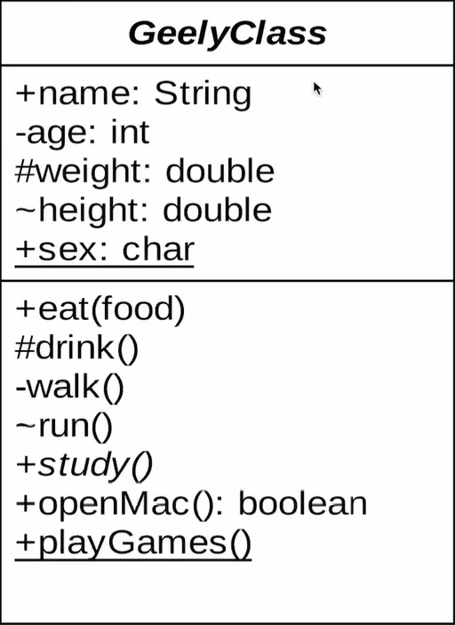
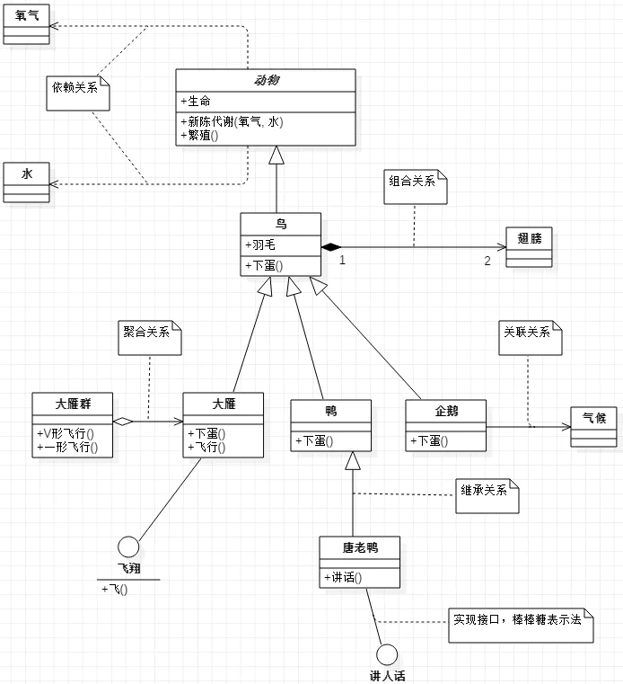
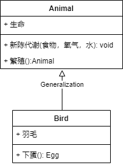
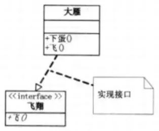
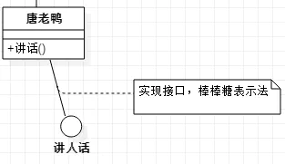
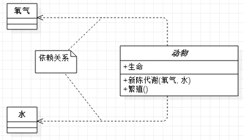
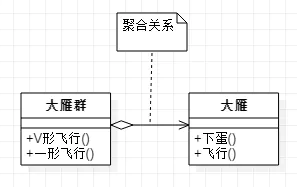
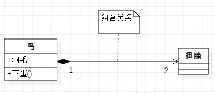

## UML类图

UML类图通常用于表示类之间的关系

### 类图的基础属性

首先看下面的一个类图

在一个类中

* -表示private
* #表示proteced
* ~表示default，包权限
* _下划线表示static
* 类名斜体表示是抽象类
* 带括号的表示方法
* 方法后面的:紧跟返回类型

### 类与类之间的关系

在类与类之间的关系通常有：泛化（Generalization）、实现（Realization）、关联（Association）、聚合（Aggregation）、组合（Composition）、依赖（Dependency）

下图表示了类之间的所有关系

#### 泛化(Generalization)
表示类与类之间的继承关系，接口与接口之间的继承关系，或者类对接口的实现关系

##### 泛化之继承(Extend)

继承表示是一个类（称为子类、子接口）继承于另一个类（称为父类、父接口）的功能，并实现自己的新功能的能力

表示方法：

继承使用*空心三角形+实线*表示

示例：鸟类继承抽象类动物

##### 泛化之实现(Realization)

实现表示一个class类实现interface接口（可以是多个）的功能。

1)矩形表示

使用*空心三角+虚线*表示

比如：大烟需要飞行，就需要实现飞()接口

2)棒棒糖表示法

使用实线表示

#### 依赖(Dependency)

两个相互独立的对象，当一个对象负责<b><u>构造</u></b>另一个对象实例的时候，或者依赖另一个对象的服务时候，这两个对象之间主要体现为依赖关系。

表示方法：

依赖关系使用<b><u>*虚线箭头*</u></b>表示

示例动物依赖氧气和水，调用新陈代谢方法需要氧气类和水类的实例作为参数

#### 关联(Association)

对于两个<b><u>相对独立</u></b>的对象，当一个对象的实例与另一个对象的一些特定实例存在<b><u>固定的对应关系</u></b>的时候。这两个对象之间为关联关系

表示方法：

关联关系使用*实线箭头*表示

企鹅需要知道气候的变化，了解气候的规律，当一个类知道另一类的时候可以用关联

#### 聚合(Aggregation)

聚合表示一种<b>*弱拥有关系*</b>，即has a的关系，体现的是A对象可以包含B对象，但是B对象不是A对象的一部分。两个对象具有各自的生命周期。

表示方法：

聚合关系使用<u><b>*空心的菱形+实线箭头*</b></u>表示

示例：

每一只大雁都属于一个大雁群。一个大雁群拥有多只大雁，但是大雁死去后大雁群不会消失，大雁群解散大雁也不会死亡，两个对象的生命周期不一样

#### 组合(Composition)

是一种<b>*强拥有关系*</b>,是一种containers a的关系，体现了严格的部分和整体的关系，部分和整体的生命周期一样

表示方法：

组合关系用<u><b>*实心的菱形+实线肩头*</b></u>表示，还可以使用连线两端的数字表示某一端有几个实例。

示例

鸟和翅膀就是组合关系，因为它们是整体和部分的关系，并且翅膀和鸟的生命周期是相同的

