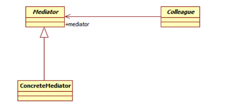

## 中介者模式

租房各位都有过的经历吧！在这个过程中中介结构扮演着很重要的角色，它在这里起到一个中间者的作用，给我们和房主互相传递信息。在外面软件的世界里同样需要这样一个中间者。在我们的系统中有时候会存在着对象与对象之间存在着很强、复杂的关联关系，如果让他们之间有直接的联系的话，必定会导致整个系统变得非常复杂，而且可扩展性很差！在前面我们就知道如果两个类之间没有不必彼此通信，我们就不应该让他们有直接的关联关系，如果实在是需要通信的话，我们可以通过第三者来转发他们的请求。同样，这里我们利用中介者来解决这个问题。

所谓中介者模式就是用一个中介对象来封装一系列的对象交互，中介者使各对象不需要显式地相互引用，从而使其耦合松散，而且可以独立地改变它们之间的交互。在中介者模式中，中介对象用来封装对象之间的关系，各个对象可以不需要知道具体的信息通过中介者对象就可以实现相互通信。它减少了对象之间的互相关系，提供了系统可复用性，简化了系统的结构。

 在中介者模式中，各个对象不需要互相知道了解，他们只需要知道中介者对象即可，但是中介者对象就必须要知道所有的对象和他们之间的关联关系，正是因为这样就导致了中介者对象的结构过于复杂，承担了过多的职责，同时它也是整个系统的核心所在，它有问题将会导致整个系统的问题。所以如果在系统的设计过程中如果出现“多对多”的复杂关系群时，千万别急着使用中介者模式，而是要仔细思考是不是您设计的系统存在问题。

Mediator: 抽象中介者
ConcreteMediator: 具体中介者
Colleague: 抽象同事类
ConcreteColleague: 具体同事类