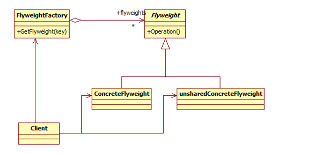

## 享元模式

在一个系统中对象会是的内存占用过多，特别是大量重复的对象，这就是对系统资源的极大浪费。享元模式对对象的重用提供了一种解决方案，它使用*共享技术*对相同或者相似的对象*实现重用*。

享元模式就是运行共享技术有效支持大量细粒度对象的复用。系统使用少量对象。享元模式通过共享技术使得系统中的对象个数大大减少了。

享元模式要求能够共享的对象必须是细粒度对象。向元模式通过共享技术使得系统中的对象个数大大减少，同时享元模式使用了内部状态和外部状态，同时外部状态相对独立，不会影响到内部状态，所以享元模式能够使得享元对象在不同的环境下被共享。

同时正是分为了内部状体和外部状态，享元模式会是的系统变的更加复杂，同时也会导致读取外部状态所消耗的时间过长



享元模式包含如下角色：
Flyweight: 抽象享元类
ConcreteFlyweight: 具体享元类
UnsharedConcreteFlyweight: 非共享具体享元类
FlyweightFactory: 享元工厂类

享元模式就是把相同的对象缓存下来

```java

public interface Shape {
   void draw();
}


public class Circle implements Shape {
   private String color;
   private int x;
   private int y;
   private int radius;
 
   public Circle(String color){
      this.color = color;     
   }
 
   public void setX(int x) {
      this.x = x;
   }
 
   public void setY(int y) {
      this.y = y;
   }
 
   public void setRadius(int radius) {
      this.radius = radius;
   }
 
   @Override
   public void draw() {
      System.out.println("Circle: Draw() [Color : " + color 
         +", x : " + x +", y :" + y +", radius :" + radius);
   }
}


import java.util.HashMap;
 
public class ShapeFactory {
   private static final HashMap<String, Shape> circleMap = new HashMap<>();
 
   public static Shape getCircle(String color) {
      Circle circle = (Circle)circleMap.get(color);
 
      if(circle == null) {
         circle = new Circle(color);
         circleMap.put(color, circle);
         System.out.println("Creating circle of color : " + color);
      }
      return circle;
   }
}


public class FlyweightPatternDemo {
   private static final String colors[] = 
      { "Red", "Green", "Blue", "White", "Black" };
   public static void main(String[] args) {
 
      for(int i=0; i < 20; ++i) {
         Circle circle = 
            (Circle)ShapeFactory.getCircle(getRandomColor());
         circle.setX(getRandomX());
         circle.setY(getRandomY());
         circle.setRadius(100);
         circle.draw();
      }
   }
   private static String getRandomColor() {
      return colors[(int)(Math.random()*colors.length)];
   }
   private static int getRandomX() {
      return (int)(Math.random()*100 );
   }
   private static int getRandomY() {
      return (int)(Math.random()*100);
   }
}

```