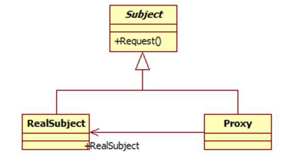

## 代理模式

代理模式就是给一个对象提供一个代理，并由代理对象控制对原对象的引用。它使得客户不能直接与真正的目标对象通信。代理对象是目标对象的代表，其他需要与这个目标对象打交道的操作都是和这个代理对象在交涉。

代理对象可以在客户端和目标对象之间起到中介的作用，这样起到了的作用和保护了目标对象的，同时也在一定程度上面减少了系统的耦合度。

代理模式包含如下角色：
Subject: 抽象主题角色
Proxy: 代理主题角色
RealSubject: 真实主题角色