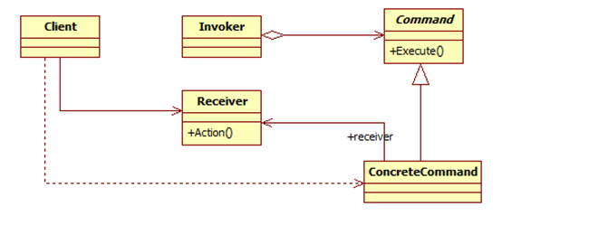

## 命令模式

有些时候我们想某个对象发送一个请求，但是我们并不知道该请求的具体接收者是谁，具体的处理过程是如何的，们只知道在程序运行中指定具体的请求接收者即可，对于这样将请求封装成对象的我们称之为命令模式。所以命令模式将请求封装成对象，以便使用不同的请求、队列或者日志来参数化其他对象。同时命令模式支持可撤销的操作。

命令模式可以将请求的发送者和接收者之间实现完全的解耦，发送者和接收者之间没有直接的联系，发送者只需要知道如何发送请求命令即可，其余的可以一概不管，甚至命令是否成功都无需关心。同时我们可以非常方便的增加新的命令，但是可能就是因为方便和对请求的封装就会导致系统中会存在过多的具体命令类。

命令模式包含如下角色：
Command: 抽象命令类
ConcreteCommand: 具体命令类
Invoker: 调用者
Receiver: 接收者
Client:客户类