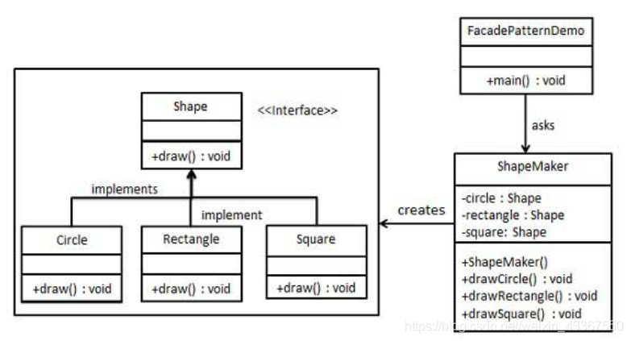

## 外观模式/门面模式

考虑：
 家庭影院系统

    幕布的开关
    投影仪的开关，亮度调节，节目选择
    躺椅的准备与收起

看电影的步骤：
 准备躺椅
 打开幕布
 打开投影仪，调节亮度，选择节目

结束看电影的步骤：
 关闭投影仪
 关闭幕布
 收起躺椅

如果是用户直接面对躺椅、幕布、投影仪，那他就得一步一步操作（尽管这里看起来不复杂），假设是一个子系统非常多的大系统，那么这些一步一步操作就会非常复杂。

可以这么做：
 弄一个Facade类，组合幕布、投影仪、躺椅，用户只需要输入一个电影名，这个影院系统就自动完成所有准备工作。




 外观模式的注意事项和细节

    * 外观模式对外屏蔽了子系统的细节，因此外观模式降低了客户端对子系统使用的复杂性
    * 外观模式对客户端与子系统的耦合关系，让子系统内部的模块更易维护和扩展
    * 通过合理的使用外观模式，可以帮我们更好的划分访问的层次
    * 当系统需要进行分层设计时，可以考虑使用Facade模式
    * 在维护一个遗留的大型系统时，可能这个系统已经变得非常难以维护和扩展，此时可以考虑为新系统开发一个Facade类，来提供遗留系统的比较清晰简单的接口， 让新系统与Facade类交互，提高复用性
    * 不能过多的或者不合理的使用外观模式，使用外观模式好，还是直接调用模块好。 要以让系统有层次，利于维护为目的。


```java
public abstract class Component {
    protected String name;

    public Component(String name) {
        this.name = name;
    }

    public abstract void operation();

   public void add(Component c) {
        throw new UnsupportedOperationException();
    }

    public void remove(Component c) {
        throw new UnsupportedOperationException();
    }

    public Component getChild(int i) {
        throw new UnsupportedOperationException();
    }

    public List<Component> getChildren() {
        return null;
    }
}


public class Composite extends Component {
    private List<Component> components = new ArrayList<>();

    public Composite(String name) {
        super(name);
    }

    @Override
    public void operation() {
        System.out.println("组合节点"+name+"的操作");
        //调用所有子节点的操作
        for (Component component : components) {
             component.operation();
        }
    }

    @Override
    public void add(Component c) {
        components.add(c);
    }

    @Override
    public void remove(Component c) {
        components.remove(c);
    }

    @Override
    public Component getChild(int i) {
        return components.get(i);
    }

    @Override
    public List<Component> getChildren() {
        return components;
    }
}


public class Leaf extends Component {

    public Leaf(String name) {
        super(name);
    }

    @Override
    public void operation() {
        System.out.println("叶节点"+name+"的操作");
    }
}


public class Client {
    public static void main(String[] args) {
        //创建根节点对象
        Component component = new Composite("component");

        //创建两个组合节点对象
        Component composite1 = new Composite("composite1");
        Component composite2 = new Composite("composite2");

        //将两个组合节点对象添加到根节点
        component.add(composite1);
        component.add(composite2);

        //给第一个组合节点对象添加两个叶子节点
        Component leaf1 = new Leaf("leaf1");
        Component leaf2 = new Leaf("leaf2");
        composite1.add(leaf1);
        composite1.add(leaf2);

        //给第二个组合节点对象添加一个叶子节点和一个组合节点
        Component leaf3 = new Leaf("leaf3");
        Component composite3 = new Composite("composite3");
        composite2.add(leaf3);
        composite2.add(composite3);

        //给第二个组合节点下面的组合节点添加两个叶子节点
        Component leaf4 = new Leaf("leaf4");
        Component leaf5 = new Leaf("leaf5");
        composite3.add(leaf4);
        composite3.add(leaf5);

        //执行所有节点的操作
        component.operation();
    }
}

```