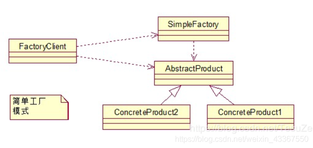

## 抽象工厂模式



 AbstractProduct：抽象类产品，比如说披萨
 ConcreteProduct：具体的产品，比如说中国披萨，美国披萨，巴西披萨等
 SimpleFactory：用于创建披萨类，依赖于抽象披萨
 FacrotyClient：工厂的使用者，通过FactoryClient，调用SimpleFactory生成不同的披萨。

 ```java
/**
 * 简单工厂
 * 涉及的角色有：工厂类、抽象产品、具体产品  (产品在common包中)
 * 优点
 * 　帮助封装。客户端可以更好的面向接口编程。
 * 　解耦。客户端不需要知道实现类。
 * 缺点
 * 　需要知道所有参数（type）的意义，增加复杂度。
 * 　不方便扩展子类，扩展的话也需要同时拓展type（修改createProduct方法）
 */

// 简单工厂
class Factory {
    public static Product createProduct(int type){
        if (type==1) {
            return new AProduct();
        }else if (type==2){
            return new BProduct();
        }else {
            return null;
        }
    }
}

// FactoryClient
public class FactoryClient {
    public static void main(String[] args) {
        Product product = Factory.createProduct(1);
        product.operation();
    }
}
 ```