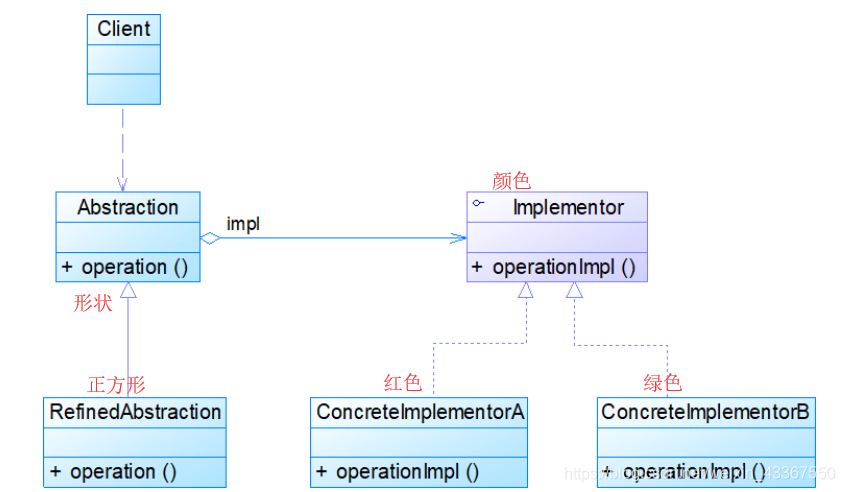

## 桥接模式

考虑这么一个问题：有“圆形”“正方形”“三角形”三个形状，然后有“红色”“绿色”“蓝色”三种颜色，现在我们需要“红色正方形”、“绿色正方形”、“蓝色正方形”、“红色三角形”、“绿色三角形”、“蓝色三角形”、“红色圆形”、“绿色圆形”、“蓝色圆形”，需要几个类？
 如果是按x色x形分别建类，那么显然需要3*3个类。
 这种实现快速简单，但是却难以扩展。比如我们现在多了一个绿色，那么就得再建三个“绿色xx形”，形成类爆炸。

这就是理解桥接模式的方式——属性维度。
 将每一维，都单独抽出来，然后通过组合聚合的形式放在一个桥接类中。

这个“抽象”与“实现”的区别，网上并没有找到结论。个人觉得，没啥区别，抽象接口直接跟Client交互，并且组合实现类，因此，可以将重要的“属性”作为抽象。或者说，抽象与实现是主从关系，实现属于抽象，比如说“颜色属于形状，因此形状是抽象，颜色是实现”。

此外，个人觉得这个二维维度可以扩展成多维。