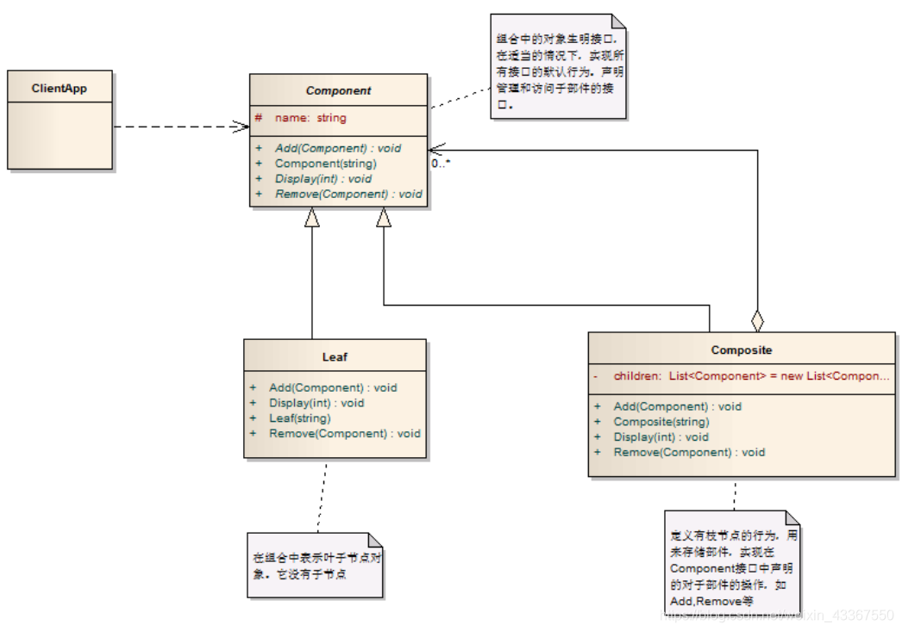

## 组合模式

常见这种形式：

    一个用户有多个订单，一个订单有多个订单详情，一个订单详情有多个商品
    一个学校有多个学院，一个学院有多个系，一个系有多个班，一个班有多个同学

这种模式，可以抽象为一棵树。学校是一个根节点，同学是叶子节点。

    * ClientApp是调用方，只跟Component发生关联
    * Component是抽象节点，包含根节点和叶子节点的所有默认行为
    * Composite是非叶子节点
    * Leaf是叶子节点。

注意：

    * Component作为抽象类时，将叶子节点也包含的行为作为抽象方法，让叶子也能实现；将叶子节点不包含的行为(如移除子节点和增加子节点)写一个默认实现，抛出不支持调用的异常，让其他子节点自己实现。
    * 一般情况下，尽管都是非叶子节点，但是也可能实现不一致（比如增加一个学院和增加一个系，实际逻辑不一样），因此不能只写一个非叶子节点，可能存在多个很相似的非叶子节点

其他细节：

    * 简化客户端操作。客户端只需要面对一致的对象而不用考虑整体部分或者节点叶子的问题。
    * 具有较强的扩展性。当我们要更改组合对象时，我们只需要调整内部的层次关系， 客户端不用做出任何改动.
    * 方便创建出复杂的层次结构。客户端不用理会组合里面的组成细节，容易添加节点 或者叶子从而创建出复杂的树形结构
    * 需要遍历组织机构，或者处理的对象具有树形结构时, 非常适合使用组合模式.
    * 要求较高的抽象性，如果节点和叶子有很多差异性的话，比如很多方法和属性都不一样，不适合使用组合模式

划重点：树形结构适合、能帮助客户端忽略节点和叶子的差异性、如果节点和叶子本身存在较大差异则不适合使用组合模式（比如学校和学生的操作肯定存在较大差异，建议将学生、班级从这个树状结构排除，让系作为叶子节点）