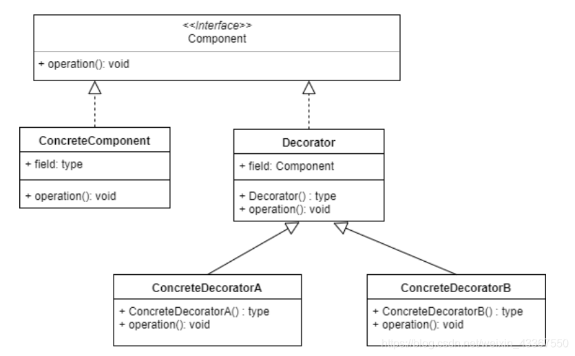
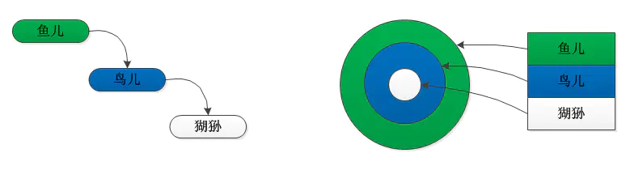

## 装饰者模式

定义
 在不改变原有对象的基础之上，将功能附加到对象上。提供了比继承更有弹性的替代方案（扩展原有对象功能）

优点

    扩展一个类的功能或者给一个类添加附加职责
    给一个对象动态的添加功能，或动态撤销功能。

 类图特点：

    被装饰者和装饰器都实现同一个接口（抽象类），该接口中有被装饰者的可装饰属性相关方法     比如说用调味品装饰咖啡，那么咖啡的描述和价格就是可装饰属性，此时该顶级接口应当带上描述和价格，只有这样，才能在装饰后对这些属性进行动态修改。

