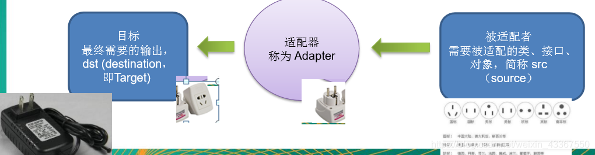
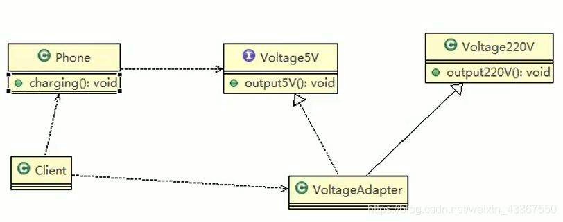
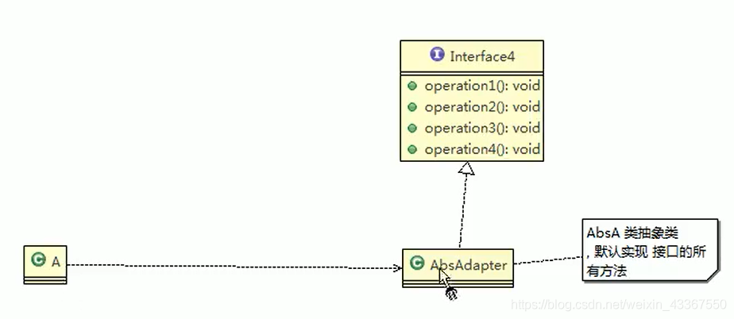

## 适配器模式

1. Adapter Pattern 将某个类的接口转换为客户期望的另一个接口表示，主要目的是兼容性，让原本因接口不匹配不能一起工作的两个类可以协同工作。其别名为包装器（Wrapper）
2. 适配器模式属于结构型模式
3. 主要分为三类： 类适配器模式、对象适配器模式、接口适配器模式

### 工作原理
1. 适配器模式： 将一个类的接口转换成另一种接口，让原本接口不兼容的类可以兼容
2. 从用户角度是看不到被适配者，是解耦的
3. 用户调用适配器转化出来的目标接口方法，适配器再调用被适配者的相关接口方法
4. 用于收到反馈接口，感觉只是和目标接口交互

### 类适配器

Adapter类，通过继承 src类，实现 dst 类接口，完成src->dst的适配。

国家只提供了220V电压，我们的手机需要5V电压，因此需要一个适配器。

适配器继承220V电压（为了拿到电压），然后实现5V的接口（相当于适配器变压标准）。接着手机充电的时候，只需要遵循5V接口就行了。然后用户Client左拿适配器（充电器），右拿手机，就可以充了。

注意事项

    Java是单继承机制，所以类适配器需要继承src类这一点算是一个缺点, 因为这要求dst必须是接口，有一定局限性;
    src类的方法在Adapter中都会暴露出来，也增加了使用的成本。
    由于其继承了src类，所以它可以根据需求重写src类的方法，使得Adapter的灵活性增强了。

### 对象适配器
Adapter类，通过持有 src类，实现 dst 类接口， 完成src->dst的适配。

细节

1. 对象适配器和类适配器其实算是同一种思想，只不过实现方式不同。 根据合成复用原则，使用组合替代继承， 所以它解决了类适配器必须继承src的局限性问题，也不再要求dst必须是接口。
2. 使用成本更低，更灵活。

### 接口适配器

1. 一些书籍称为：适配器模式(Default Adapter Pattern)或缺省适配器模式。
2. 当不需要全部实现接口提供的方法时，可先设计一个抽象类实现接口，并为该接口中每个方法提供一个默认实现（空方法），那么该抽象类的子类可有选择地覆盖父类的某些方法来实现需求
3. 适用于一个接口不想使用其所有的方法的情况。

如上图，接口提供了4个方法，如果我们直接实现接口，将不得不实现全部方法。但是我们加一个适配器，实现接口中的全部方法（但是都是空方法，没有写具体实现），然后A继承适配器，就可以有选择的重写自己想要的方法。