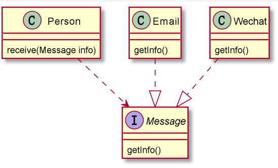

## 依赖倒转(倒置)原则

1. 高层模块不应该依赖底层模块，二者都应该依赖其抽象
2. 抽象不应该依赖于细节，抽象应该依赖于抽象
3. 依赖倒转（倒置）的中心思想是面向对象编程
4. 相对于细节的多变性，抽象的东西要稳定很多，以抽象为基础搭建的架构比以细节搭建的要稳定的多，在Java中，抽象指接口和抽象类，细节就是实现类
5. 使用接口和抽象类的目的是制定好规范，而不涉及任何具体的操作，把展示细节的任务交给他们的实现类去完成


### 应用实例

需求：

完成person接收消息的功能

```java

public class DependenceInversionPrinciple {
    public static void main(String[] args) {
        new Person().receive(new Email());
    }
}
class Email {
    public String getInfo(){
        return "电子邮件信息: Hello world";
    }
}
class Person{
    // 消息接收
    public void receive(Email email){
        System.out.println(email.getInfo());
    }
}
```

这样子就基本实现了，但是存在问题不利于后序改造

使用依赖倒置原则进行改造，将消息抽象出一个抽象层，让person去依赖




```java

public class DependenceInversionPrinciple2 {
    public static void main(String[] args) {
        new Person2().receive(new Email2());
        new Person2().receive(new Wechat2());
    }
}

interface Message {
    String getInfo();
}

class Email2 implements Message {
    @Override
    public String getInfo() {
        return "电子邮件信息: Hello world";
    }
}

class Wechat2 implements Message {
    @Override
    public String getInfo() {
        return "微信: Hello world";
    }
}

class Person2 {
    // 消息接收
    public void receive(Message message) {
        System.out.println(message.getInfo());
    }
}
```

### 依赖传递的三种方式

#### 接口传递


```java
/**
 * 通过接口传递依赖
 */
public class DepGx {
    public static void main(String[] args) {
        Tv tv = new Tv();
        XiaoMi xiaoMi = new XiaoMi();
        tv.open(xiaoMi);
        tv.close(xiaoMi);
    }
}

/**
 * 开关接口
 */
interface IOpenAndClose {
    void open(ITV itv);
    void close(ITV itv);
}

/**
 * 电视接口
 */
interface ITV{
    void open();
    void close();
}

/**
 * 小米实现
 */
class XiaoMi implements ITV{
    @Override
    public void open() {
        System.out.println("小米电视 open...");
    }

    @Override
    public void close() {
        System.out.println("小米电视 close...");
    }
}

/**
 * 电视实现开关功能
 */
class Tv implements IOpenAndClose{
    @Override
    public void open(ITV itv) {
        itv.open();
    }

    @Override
    public void close(ITV itv) {
        itv.close();
    }
}
```


#### 构造方法传递依赖

基于接口传递的改造

虽然现在是面向接口编程，但是接口的高度不够，如果我想扩展冰箱就无能为力了，而且冰箱也有开关功能，所以进行模型优化


在电视和冰箱的上层抽离出了家电,然后让开关的接口直接依赖于家电接口,这样就可以通用冰箱和电视了,按道理来说,突然感觉抽象成接口直接让IOpenAndClose去面对家电功能接口又不太好,应该抽象出来一个抽象类(家电)去实现这个接口,然后让小米TV和海尔冰箱去继承这个抽象类的,在下面的Setter方式传递的时候再优化

```java
/**
 * 通过接口传递依赖
 */
public class DepGx {
    public static void main(String[] args) {
        XiaoMiTv xiaoMiTv = new XiaoMiTv();
        xiaoMiTv.open(new XiaoMi());
        xiaoMiTv.close(new XiaoMi());
        HaiErBx haiErBx = new HaiErBx();
        haiErBx.open(new HaiEr());
        haiErBx.close(new HaiEr());
    }
}

/**
 * 开关接口
 */
interface IOpenAndClose {
    void open();
    void close();
}

public abstract class Controller implements IOpenAndClose{
    private HouseholdElectricalAppliances appliance;

    public Controller(HouseholdElectricalAppliances appliance) {
        this.appliance = appliance;
    }

    @Override
    public abstract void close();

    @Override
    public abstract void open();
}

/**
 * 家电功能接口
 */
interface HouseholdElectricalAppliances {
    void open();
    void close();
}

/**
 * 电视接口
 */
interface ITV extends HouseholdElectricalAppliances{

}

/**
 * 冰箱接口
 */
interface IRefrigerator extends HouseholdElectricalAppliances{

}

/**
 * 小米电视
 */
class XiaoMiTV implements ITV{
    @Override
    public void open() {
        System.out.println("小米电视 open...");
    }

    @Override
    public void close() {
        System.out.println("小米电视 close...");
    }
}

/**
 * 小米电视遥控器
 */
class XiaoMiController extends Controller{
    public XiaoMiController(HouseholdElectricalAppliances appliance) {
        super(appliance);
    }
    @Override
    public void open() {
        appliance.open();
    }

    @Override
    public void close() {
        appliance.close();
    }
}

/**
 * 海尔冰箱
 */
class HaiEr implements IRefrigerator {
    @Override
    public void open() {
        System.out.println("海尔冰箱 手动打开");
    }

    @Override
    public void close() {
        System.out.println("海尔冰箱 手动关闭");
    }
}

/**
 * 海尔冰箱遥控器
 */
class HaiErController implements Controller{
    public HaiErController (HouseholdElectricalAppliances appliance) {
        super(appliance);
    }

    @Override
    public void open() {
        appliance.open();
    }

    @Override
    public void close() {
        appliance.close();
    }
}
```

#### setter方式传递


又对上面的模型进行了优化, IOpenAndClose这个开关功能类, 并不应该面向家电抽象,应为他是一个通用的功能, 应该面向更高层的对象, 那就是泛型<T>, 谁实现,谁指定面向什么,应为开关可能是基于电视的,但是还可能是基于门的,没有任何一类可以归纳它,所以定义成泛型, 然后家电抽象类去实现这个接口,提供默认的调用实现, 然后小米电视和海尔冰箱去继承家电的抽象类,应为抽象类中提供了默认的实现,而且业务也就是简单的调用而已,所以不需要重写, 并且家电抽象类指定的泛型是家电功能接口,也就是Hou...able, 具体的打开方式由另外的功能类去实现,也就是小米Able和HaiErAble, 而家电抽象类面向的就是家电功能接口,emm这个模型比上面的要好很多

只是用来做例子而已,如果是真正开发的话,按道理来说, 家电下面应该还可以抽象出电视抽象类,冰箱抽象类,应为都是种类而不是具体的实现,所以... 开发还是要看具体的实践

```java
public class DepGX2 {
    public static void main(String[] args) {
        HouseholdElectricalAppliances xiaomi = new XiaoMiTv();
        HouseholdElectricalAppliancesAble xiaomiable = new XiaoMiAble();
        xiaomi.open(xiaomiable);
        xiaomi.close(xiaomiable);
        HouseholdElectricalAppliances haier = new HaiErBx();
        HouseholdElectricalAppliancesAble haierable = new HaiErAble();
        haier.open(haierable);
        haier.close(haierable);
    }
}
/**
 * 开关接口
 */
interface IOpenAndClose<T> {
    void open(T t);
    void close(T t);
}

/**
 * 家电功能接口
 */
interface HouseholdElectricalAppliancesAble{
    void open();
    void close();
}
/**
 * 家电抽象类
 */
abstract class HouseholdElectricalAppliances implements IOpenAndClose<HouseholdElectricalAppliancesAble> {

    /**
     * 功能接口
     */
    protected HouseholdElectricalAppliancesAble householdElectricalAppliancesAble;
    
    @Override
    public void open(HouseholdElectricalAppliancesAble householdElectricalAppliancesAble) {
        householdElectricalAppliancesAble.open();
    }

    @Override
    public void close(HouseholdElectricalAppliancesAble householdElectricalAppliancesAble) {
        householdElectricalAppliancesAble.close();
    }
    
    public void setHouseholdElectricalAppliancesAble(HouseholdElectricalAppliancesAble householdElectricalAppliancesAble){
        this.householdElectricalAppliancesAble = householdElectricalAppliancesAble;
    }

    public void open(){
        open(householdElectricalAppliancesAble);
    }
    public void close(){
        close(householdElectricalAppliancesAble);
    }
}

/**
 * 小米遥控器
 */
class XiaoMiAble implements HouseholdElectricalAppliancesAble{
    @Override
    public void open() {
        System.out.println("小米电视 open...");
    }

    @Override
    public void close() {
        System.out.println("小米电视 close...");
    }
}
/**
 * 冰箱遥控器
 */
class HaiErAble implements HouseholdElectricalAppliancesAble{
    @Override
    public void open() {
        System.out.println("冰箱 open...");
    }

    @Override
    public void close() {
        System.out.println("冰箱 close...");
    }
}
/**
 * 小米电视
 */
class XiaoMiTv extends HouseholdElectricalAppliances{

}
/**
 * 小米电视
 */
class HaiErBx extends HouseholdElectricalAppliances{

}
```


#### 注意事项和细节

1. 低层模块尽量都要有抽象类或者接口或者两者都有,程序稳定性更好
2. 变量的声明类型尽量是抽象类或接口, 这样我们的变量引用和实际对象间,就存在一个缓冲层,利于程序扩展和优化
3. 继承时遵循里式替换原则

