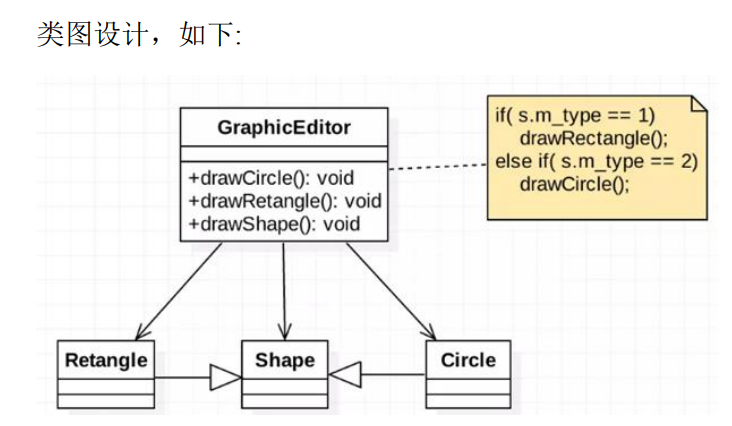

## 开闭原则

1. 开闭原则是编程中最基础，最重要的原则
2. 一个软件实体，如类，实体，模块和函数，应该对扩展开放（对软件提供方），对修改关闭（对调用方），用抽象架构框架，用实现扩展细节
3. 当软件变化时，尽量使用扩展软件实体的行为来实现变化，而不是通过修改已有代码
4. 编程中遵守其他原则，以及使用设计模式的目的就是遵循开闭原则



```java
/**
 * 开闭原则
 */
public class OpenClosePrinciples {
    public static void main(String[] args) {
        Ge ge = new Ge();
        ge.ds(new R());
        ge.ds(new C());
        ge.ds(new T());
    }
}

/**
 * 绘图的类[使用方]
 */
class Ge{
    /**
     * 接收SP对象,根据SP绘制不同的图像
     */
    public void ds(Sp sp){
        if (sp.m_type == 1){
            dr(sp);
        }else if(sp.m_type == 2){
            dc(sp);
        }else if(sp.m_type == 3){
            dt(sp);
        }
    }
    private void dr(Sp sp){
        System.out.println("绘制矩形");
    }
    private void dc(Sp sp){
        System.out.println("绘制圆形");
    }
    private void dt(Sp sp){
        System.out.println("绘制三角形");
    }
}

/**
 * 基类 用于类型判断
 */
class Sp{
    int m_type;
}

/**
 * 矩形
 */
class R extends Sp{
    R(){
        m_type = 1;
    }
}

/**
 * 圆形
 */
class C extends Sp{
    C(){
        m_type = 2;
    }
}

/**
 * 三角形
 */
class T extends Sp{
    T(){
        m_type = 3;
    }
}
```

修改为下面方案

```java
/**
 * 开闭原则
 */
public class OpenClosePrinciples {
    public static void main(String[] args) {
        Ge ge = new Ge();
        ge.ds(new R());
        ge.ds(new C());
        ge.ds(new T());
    }
}

/**
 * 绘图的类[使用方]
 */
class Ge{
    /**
     * 接收SP对象,根据SP绘制不同的图像
     */
    public void ds(Sp sp){
        sp.ds();
    }
}

/**
 * 基类 用于类型判断
 */
abstract class Sp{
    int m_type;
    abstract void ds();
}

/**
 * 矩形
 */
class R extends Sp{
    R(){
        m_type = 1;
    }
    public void ds(){
        System.out.println("绘制矩形");
    }
}

/**
 * 圆形
 */
class C extends Sp{
    C(){
        m_type = 2;
    }
    public void ds(){
        System.out.println("绘制圆形");
    }
}

/**
 * 三角形
 */
class T extends Sp{
    T(){
        m_type = 3;
    }

    public void ds(){
        System.out.println("绘制三角形");
    }
}
```