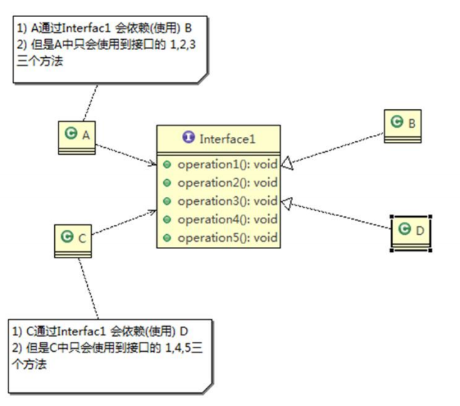
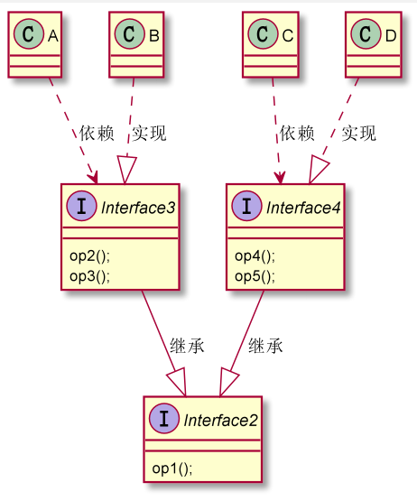

## 接口隔离原则

一个客户端不应该依赖它不需要的接口，一个类对另一个类的依赖应该建立在最小的接口上

```java

/**
 * 接口隔离原则
 */
/**
 * 接口
 */
interface Interface1 {
    void operation1();

    void operation2();

    void operation3();

    void operation4();

    void operation5();
}

class B implements Interface1 {
    @Override
    public void operation1() {
        System.out.println("B 实现了 op1");
    }

    @Override
    public void operation2() {
        System.out.println("B 实现了 op2");
    }

    @Override
    public void operation3() {
        System.out.println("B 实现了 op3");
    }

    @Override
    public void operation4() {
        System.out.println("B 实现了 op4");
    }

    @Override
    public void operation5() {
        System.out.println("B 实现了 op5");
    }
}
class D implements Interface1 {
    @Override
    public void operation1() {
        System.out.println("D 实现了 op1");
    }

    @Override
    public void operation2() {
        System.out.println("D 实现了 op2");
    }

    @Override
    public void operation3() {
        System.out.println("D 实现了 op3");
    }

    @Override
    public void operation4() {
        System.out.println("D 实现了 op4");
    }

    @Override
    public void operation5() {
        System.out.println("D 实现了 op5");
    }
}

/**
 * A类依赖于 接口的 1 2 3 方法
 */
class A {
    public void dp1(Interface1 i){
        i.operation1();
    }
    public void dp2(Interface1 i){
        i.operation2();
    }
    public void dp3(Interface1 i){
        i.operation3();
    }
}
/**
 * C类依赖于 接口的 1 4 5 方法
 */
class C {
    public void dp1(Interface1 i){
        i.operation1();
    }
    public void dp4(Interface1 i){
        i.operation4();
    }
    public void dp5(Interface1 i){
        i.operation5();
    }
}
```

以上的模型如下图所示



但是a会因为依赖接口而依赖到不需要的方法

可以将接口进行拆分

```java

interface Interface2 {
    void operation1();
}

interface Interface3 extends Interface2 {
    void operation2();

    void operation3();
}

interface Interface4 extends Interface2 {
    void operation4();

    void operation5();
}

class B1 implements Interface3 {
    @Override
    public void operation1() {
        System.out.println("B 实现了 op1");
    }

    @Override
    public void operation2() {
        System.out.println("B 实现了 op2");
    }

    @Override
    public void operation3() {
        System.out.println("B 实现了 op3");
    }
}

class D1 implements Interface4 {
    @Override
    public void operation1() {
        System.out.println("D 实现了 op1");
    }

    @Override
    public void operation4() {
        System.out.println("D 实现了 op4");
    }

    @Override
    public void operation5() {
        System.out.println("D 实现了 op5");
    }
}

/**
 * A类依赖于 接口的 1 2 3 方法
 */
class A1 {
    public void dp1(Interface3 i) {
        i.operation1();
    }

    public void dp2(Interface3 i) {
        i.operation2();
    }

    public void dp3(Interface3 i) {
        i.operation3();
    }
}

/**
 * C类依赖于 接口的 1 4 5 方法
 */
class C1 {
    public void dp1(Interface4 i) {
        i.operation1();
    }

    public void dp4(Interface4 i) {
        i.operation4();
    }

    public void dp5(Interface4 i) {
        i.operation5();
    }
}
```

接口隔离之后的uml图如下：

