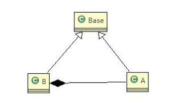

## 里氏替换原则

1. 继承包含这样一层定义，凡是父类中已经实现好的方法，实际上实在设计规范和契约。虽然不强制所有的子类必须遵循这些契约，但是如果子类对这些已经实现的方法任意修改，就会对整个继承体系造成破坏
2. 继承再给程序设计带来便利的同时，也带来了弊端，比如使用继承会给程序带来侵入性，程序的可移植性降低，增加对象之间的耦合性，如果一个类被其他的类所继承，则当这个类需要修改的时候，必须考虑到所有子类，并且父类修改后，所有涉及到子类的功能都有可能发生故障
3. 在编程中如何正确继承-->里氏替换原则

基本介绍：

1. 如果每个类型为T1的对象o1，都有类型为T2的对象o2，使得以T1定义的程序P在所有的对象o1都替换成o2时，程序的行为没有任何变化，那么类型T2是类型T1 的子类型，所有使用其基类的地方都必须透明的使用其子类对象
2. 在使用继承的时候，准寻里氏替换原则，在子类中尽量不要重写父类的方法
3. 里氏替换原则告诉我们，继承实际上是让两个类耦合性增强了，适当情况下可以使用聚合组合依赖来解决问题

```java

/**
 * 里式替换原则
 */
public class InternalSubstitutionPrinciple {
    public static void main(String[] args) {
        System.out.println(new B().fun1(11, 3));// 本意是求11-3
        System.out.println(new B().fun2(11, 3));// 和 + 9
    }
}

/**
 * 提供减法功能
 */
class A {
    public int fun1(int a, int b) {
        return a - b;
    }
}

/**
 * 扩展自A 实现加法
 */
class B extends A {
    // 无意识重写了A的方法
    @Override
    public int fun1(int a, int b) {
        return a + b;
    }

    public int fun2(int a, int b) {
        return fun1(a, b) + 9;
    }
}
```

B重写了A的方法导致原来正常的功能出现了错误

让父类子类都继承一个更基础的基类，原来的继承关系使用组合，聚合，依赖来实现



```java

/**
 * 里式替换原则
 */
public class InternalSubstitutionPrinciple {
    public static void main(String[] args) {
        System.out.println(new B().fun1(11, 3));// 11 + 3
        System.out.println(new B().fun2(11, 3));// 和 + 9
        System.out.println(new B().fun3(11, 3));// 11 - 3
    }
}

class Base{

}

/**
 * 提供减法功能
 */
class A extends Base{
    public int fun1(int a, int b) {
        return a - b;
    }
}

/**
 * 扩展自A 实现加法
 */
class B extends Base {

    /**
     * 采用依赖的关系来扩展
     */
    private A a = new A();

    // 无意识重写了A的方法
    public int fun1(int a, int b) {
        return a + b;
    }

    public int fun2(int a, int b) {
        return fun1(a, b) + 9;
    }

    public int fun3(int a,int b){
        return this.a.fun1(a,b);
    }
}
```