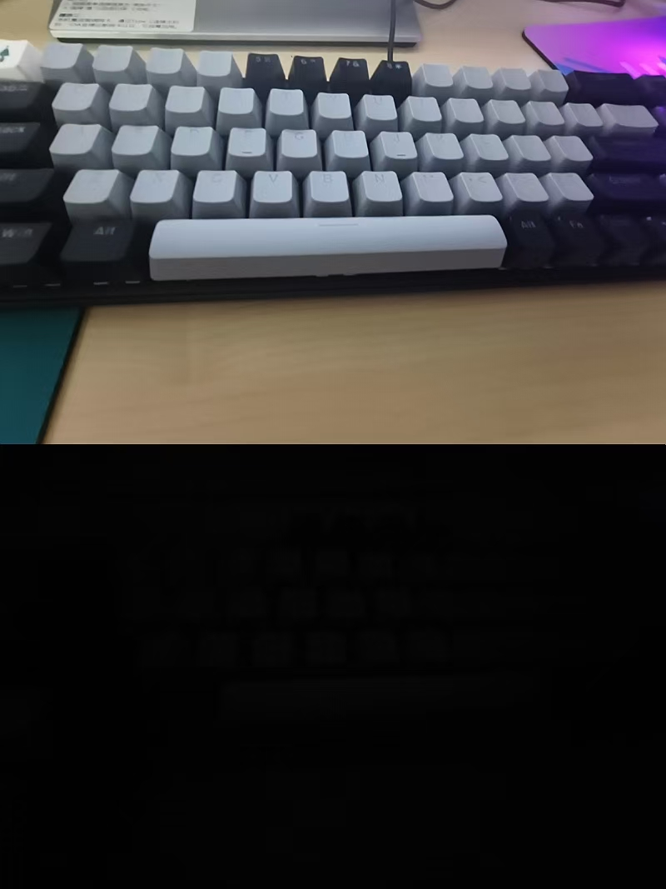

# 专业词扫盲

## 快门

快门是一个**控制进光量**同时也是**控制拍摄**的按钮。
控制进光量是通过控制快门速度（单位s）来实现的，快门速度越快，进光量越少，画面越暗，下面是不同快门速度成像对比，上面快门速度是0.8s，下面快门速度是1/400s

## 光圈（F1.6）

控制进光量的闸门装置，同时也能控制景深的大小

F后面的数字表示光圈大小，数字越小，光圈越大，进光量越大，画面越亮

## 感光度（ISO）

相机传感器对光线的敏锐度，影响曝光也掌握画质的好坏

ISO越低，光敏越低，画面越暗，ISO越高，画面越亮，但是画质越差（噪点多）

## 白平衡

相机对白颜色的还原准确度，对画面的冷暖控制

## 色温

照片画面冷暖，单位为K，k值越高画面越暖、画面发黄，越低画面越冷、画面发蓝

## 焦距

决定了取景范围，焦距越小，视野越宽，广角、标头、长焦镜头

| 焦距  | 视角  | 场景                                       |
| ----- | ----- | ------------------------------------------ |
| 14mm  | 114° | 拍摄下眼前的所有东西，适合气势恢宏的大场面 |
| 35mm  | 63°  | 人文拍摄，能将任务和环境同时表现           |
| 50mm  | 46°  | 人像和人文都可以                           |
| 85mm  | 28°  | 人像                                       |
| 200mm | 12°  | 动物、花鸟                                 |

## 定焦

固定焦距的镜头，只有一个视野，光圈大，成像好

## 变焦

不止一个焦距和视野，便捷，性价比高

## 景深

聚焦完成后，前景和后景的距离

前后都会虚化，好处：有虚实，画面层次感好，主体突出

影响景深的三要素：光圈，焦段，主体与前景/后景的距离

光圈越大，焦段越长，距离越远，景深越浅，效果好
